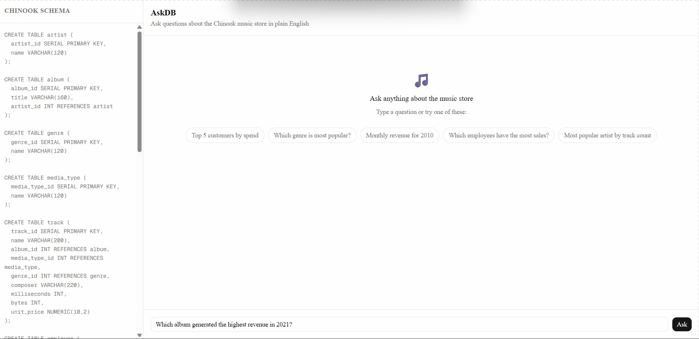
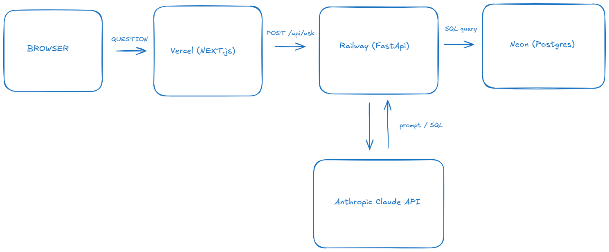

# AskDB

> Natural language to SQL, powered by Claude AI (API). Ask questions about a music store in plain English — get real data back instantly.

**[Live Demo](https://askdp.vercel.app)** · Phase 1 of 4

---

## What it does

Type a question like _"Which genre is most popular in Germany?"_ and AskDB:

1. Sends it to Claude with the full database schema as context via api
2. Gets back a SQL query
3. Executes it against a real Postgres database
4. Returns the results as a table

No SQL knowledge required.

---

## Demo



---

## Architecture



---

## Tech Stack

| Layer         | Technology                                      |
| ------------- | ----------------------------------------------- |
| Frontend      | Next.js 14, TypeScript, Tailwind CSS, shadcn/ui |
| Backend       | Python, FastAPI, uvicorn                        |
| AI            | Anthropic Claude (claude-sonnet-4-5)            |
| Database      | PostgreSQL (Neon serverless)                    |
| Deployment    | Vercel (frontend), Railway (backend)            |
| Observability | Sentry, query logging, token tracking           |

---

## For Running locally

### Prerequisites

- Node.js 22+
- Python 3.12+
- Docker

### Backend

```bash
cd api
python -m venv venv
venv\Scripts\activate        # Windows
pip install -r requirements.txt
uvicorn main:app --reload
```

### Frontend

```bash
cd web
npm install
npm run dev
```

### Environment variables

Create `askdp/.env`:

- ANTHROPIC_API_KEY=your_key_here
- DATABASE_URL=your_postgres_url
- SENTRY_DSN=your_sentry_dsn

Create `askdp/web/.env.local`:

- NEXT_PUBLIC_API_URL=http://127.0.0.1:8000

---

## Known Limitations

These are real - not excuses, just honest engineering notes:

- **No query memory** — each question is stateless. "Show me more of those" doesn't work.
- **Schema is hardcoded** — the Chinook schema is pasted as a string in the backend. Dynamic schema introspection is Phase 2.
- **Claude sometimes hallucinates column names** — especially on ambiguous questions. The error is shown clearly but not auto-corrected.
- **No auth** — anyone with the URL can query. Rate limiting (10/min per IP) is the only guard.
- **Neon cold starts** — first query after inactivity can be slow (~2-3s).
- **Aggregate queries only return one row** — the row limit wrapper works correctly but can confuse users expecting a single number without a table.

---

## What's coming (Phase 2)

- [ ] Dynamic schema introspection — works on any Postgres database
- [ ] Query history per session
- [ ] Chart rendering for numeric results
- [ ] Self-healing queries — retry with error context when SQL fails

---

## Query Log

Every question asked is logged to Postgres with: question, generated SQL, result count, token usage, and duration. This powers the eval set for Phase 2 improvements.

---

Built by [Munya](https://github.com/NhanahMunya) · Chinook dataset by [lerocha](https://github.com/lerocha/chinook-database)
